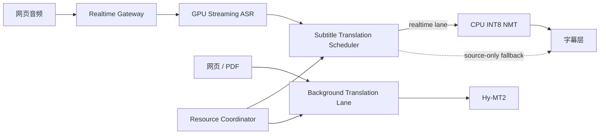

# GPU 流式 ASR 与低延迟 NMT 调度设计

状态：设计完成，待实现

适用场景：单张 RTX 4060 8GB、本地流式 ASR、实时网页视频字幕

## 1. 背景

GPU 流式 ASR 与本地大语言模型翻译可以同时常驻显存，但“可以装下”不代表“可以稳定实时运行”。字幕链路的主要风险是 Hy-MT2 长时间生成占用 GPU，导致 ASR 解码排队，最终表现为原文和译文同时卡顿。

当前实现已经具备以下保护：

- 本地流式 ASR 与 Hy-MT2 组合时，最终字幕翻译并发为 1。
- 部分结果采用 latest-wins 队列，同一时刻最多执行一个翻译请求。
- 新 revision 或最终结果到达时，通过 `AbortController` 取消旧请求。
- 本地字幕翻译限制为 48 个输出 token。

这些措施可以控制 Node 侧请求数量，但客户端取消不等于推理服务已经停止 GPU 解码。因此，GPU ASR 上线后不能继续把 Hy-MT2 作为实时字幕的默认关键路径。

## 2. 设计目标

1. ASR 首个部分结果不因翻译负载明显回退。
2. 实时字幕翻译使用短句专用 NMT，不使用开放式长生成。
3. 部分字幕只保留最新 revision，最终字幕具有最高优先级。
4. 实时会话期间限制网页、PDF 和其他后台翻译占用 GPU。
5. 翻译超时时继续展示原文，不阻塞 ASR 和后续字幕。
6. 运行参数和模型保持可配置，不把特定语言或模型写死在调度器中。
7. 保留 Hy-MT2 兼容路径，但将其移出默认实时链路。

## 3. 决策摘要

### 3.1 默认方案

实时字幕使用独立的 CTranslate2 NMT 服务，默认运行在 CPU：

```text
GPU 0: 流式 ASR
CPU:   INT8 专用 NMT
GPU 0: Hy-MT2 常驻但实时会话期间不接收字幕请求
```

选择 CPU NMT 的原因：

- 从根源上消除 ASR 与翻译之间的 GPU 计算竞争。
- 短字幕输入适合小批量、greedy decoding。
- INT8 模型显存占用为零，8GB GPU 可为 ASR 保留安全余量。
- NMT 输出长度天然受输入约束，不会出现 LLM 持续生成解释文本。

### 3.2 兼容方案

专用 NMT 未部署时，可以继续使用 Hy-MT2，但必须满足：

- `llama-server --parallel 1`
- 字幕 `max_tokens` 不超过 48，建议从 32 开始测试。
- 字幕请求只允许单并发。
- pending partial 队列容量为 1，新 revision 覆盖旧 revision。
- 最终字幕到达时取消旧 partial，并优先进入下一次推理。
- 超过截止时间后显示原文，不继续等待译文。
- 实时会话期间暂停网页和 PDF 的 Hy-MT2 请求。

`AbortController` 只作为客户端取消机制。是否立即释放 llama.cpp slot 需要通过服务指标验证，不能作为硬实时保证。

## 4. 目标架构



实时字幕和后台翻译必须是两个独立流量等级：

| 流量等级 | 用途 | 优先级 | 队列策略 |
|----------|------|--------|----------|
| `realtime-final` | 最终字幕 | 最高 | 有界 FIFO，最多 2 条 |
| `realtime-partial` | 预览字幕 | 高 | latest-wins，最多 1 条 |
| `interactive` | 划词、单段网页翻译 | 中 | 实时会话期间限流 |
| `background` | 整页、PDF 翻译 | 低 | 实时会话期间暂停或排队 |

## 5. 字幕调度器

新增独立的 `SubtitleTranslationScheduler`，从 WebSocket 会话编排中分离翻译状态。

### 5.1 状态

```js
{
  activeRequest,
  pendingFinals,
  latestPartial,
  generation,
  providerHealth
}
```

### 5.2 调度规则

1. 新 partial 到达时覆盖 `latestPartial`，不累计历史 partial。
2. final 到达时清空对应 generation 的 partial。
3. 当前请求结束后，先取 final，再取 latest partial。
4. 已发送到 Provider 的结果必须携带 `sessionId`、`generation` 和 `revision`。
5. 返回结果与当前 revision 不一致时直接丢弃。
6. final 队列超过 2 条时合并相邻短句，不能无限堆积。
7. Provider 超时或不可用时立即发送 source-only 字幕。

建议截止时间：

| 请求类型 | soft deadline | hard deadline |
|----------|---------------|---------------|
| partial | 180 ms | 300 ms |
| final | 350 ms | 600 ms |

soft deadline 用于记录性能退化；hard deadline 用于停止等待和释放调度器。具体数值应根据本机基准调整。

## 6. 专用 NMT 服务

### 6.1 接口

第一版使用本地 HTTP 服务：

```http
POST /translate
Content-Type: application/json
```

```json
{
  "texts": ["source subtitle"],
  "sourceLanguage": "ja",
  "targetLanguage": "zh-CN",
  "maxOutputTokens": 64,
  "deadlineMs": 300
}
```

响应：

```json
{
  "translations": ["translated subtitle"],
  "model": "configured-nmt-model",
  "inferenceMs": 42
}
```

约束：

- 模型在进程启动时加载一次。
- 每个请求最多包含当前字幕需要的短文本。
- `beam_size=1`，不返回分数。
- 限制最大输入和输出长度。
- 服务端验证 deadline，过期结果不得继续进入显示链路。
- `/health` 返回模型、设备、量化类型和最近延迟，不返回字幕内容。

### 6.2 CTranslate2 配置

建议默认值：

```dotenv
SUBTITLE_TRANSLATION_PROVIDER=local-nmt
NMT_ENDPOINT=http://127.0.0.1:8002
NMT_MODEL_DIR=C:\path\to\ctranslate2-model
NMT_DEVICE=cpu
NMT_COMPUTE_TYPE=int8
NMT_BEAM_SIZE=1
NMT_INTER_THREADS=1
NMT_INTRA_THREADS=4
NMT_MAX_INPUT_TOKENS=128
NMT_MAX_OUTPUT_TOKENS=64
NMT_PARTIAL_TIMEOUT_MS=300
NMT_FINAL_TIMEOUT_MS=600
```

线程数需要根据 CPU 实测。总线程数不能挤占音频采集、Node 事件循环和 ASR 数据搬运所需的 CPU 时间。

### 6.3 候选模型

模型选择通过基准确定，不在扩展代码中硬编码：

| 候选 | 优点 | 风险 |
|------|------|------|
| OPUS-MT 日→英→中两阶段 | 模型较小，两个官方模型均为 Apache-2.0 | 两次推理，转译可能损失语气和专有名词 |
| 直接日→中 OPUS/Marian 模型 | 单次推理，延迟最低 | 需要核对模型来源、许可证和字幕域质量 |
| NLLB-200 distilled 600M | 直接支持多语言互译 | CC-BY-NC，仅适合非商业研究评估，且模型更大 |

推荐先比较“直接模型”和“官方 OPUS 两阶段”两个 CPU INT8 方案。NLLB 只作为非商业质量基线，不作为默认发布模型。

## 7. GPU 与任务隔离

### 7.1 实时会话锁

`ResourceCoordinator` 维护实时会话计数：

```text
0 个实时会话：网页/PDF 可使用 Hy-MT2
1 个及以上实时会话：暂停新的 Hy-MT2 后台请求
实时会话结束并空闲 1500 ms：恢复后台队列
```

已经执行的后台请求不能依赖浏览器取消来保证 GPU 立即释放。进入实时模式前应等待活动请求结束；超过切换期限则继续 ASR，但只显示原文，直到 GPU 空闲。

### 7.2 显存余量

运行时记录：

- ASR 模型加载后的稳定显存。
- Hy-MT2 常驻但空闲时的显存。
- 两个模型同时驻留时的峰值。
- 长时间播放时的显存增长。

8GB 显卡建议至少保留 10% 安全余量。达到警戒线后按以下顺序降级：

1. 禁止新的 Hy-MT2 请求。
2. 将 Hy-MT2 减少 GPU offload 或切换为按需启动。
3. NMT 保持 CPU 模式。
4. ASR 不自动切回 CPU，避免延迟模型突然变化；改为显示明确错误。

## 8. Hy-MT2 兼容模式加固

在专用 NMT 完成前，现有路径增加以下配置：

```dotenv
LOCAL_LLM_SUBTITLE_MAX_TOKENS=32
LOCAL_LLM_SUBTITLE_TIMEOUT_MS=450
LOCAL_LLM_MAX_CONCURRENCY=1
LOCAL_LLM_PAUSE_BACKGROUND_DURING_REALTIME=true
```

同时向支持该字段的 llama.cpp 服务发送 `t_max_predict_ms`。该参数只作为第二道限制，因为服务端超时的具体触发条件不能替代客户端 hard deadline。

启动建议：

```text
--parallel 1
--ctx-size 1024 或 1536
--n-predict 48
--flash-attn on
```

上下文大小必须覆盖系统提示、输入和最大输出；最终值以实际模型模板的 token 数为准。

## 9. 代码结构

```text
scripts/server/
├── translation/
│   ├── local-nmt.mjs                  # NMT Provider 客户端
│   ├── local-hy-mt2.mjs               # LLM 兼容 Provider
│   └── subtitle-scheduler.mjs          # final/partial 优先级与 latest-wins
├── runtime/
│   └── resource-coordinator.mjs        # 实时与后台任务仲裁
└── nmt/
    └── ctranslate2-server.py           # 常驻 CPU INT8 NMT 服务

test/server/
├── subtitle-scheduler.test.mjs
├── resource-coordinator.test.mjs
└── local-nmt.test.mjs
```

字幕翻译 Provider 统一返回：

```js
{
  translations,
  provider,
  model,
  inferenceMs,
  expired
}
```

## 10. 可观测性

新增指标：

- `asr_first_partial_ms`
- `asr_decode_p50_ms` / `asr_decode_p95_ms`
- `nmt_queue_ms`
- `nmt_inference_ms`
- `subtitle_first_translation_ms`
- `subtitle_final_translation_ms`
- `partial_replaced_count`
- `translation_deadline_exceeded_count`
- `background_paused_ms`
- `gpu_vram_used_mb`
- `gpu_asr_latency_regression_ms`

日志不得记录完整字幕。调试模式最多记录长度、revision、Provider 和耗时。

## 11. 验收标准

在同一组日语视频片段上分别测试 ASR-only、ASR+NMT、ASR+Hy-MT2：

1. ASR+NMT 的首个 ASR partial P95 相对 ASR-only 回退不超过 50 ms。
2. NMT partial 翻译 P50 不高于 180 ms，P95 不高于 300 ms。
3. NMT final 翻译 P95 不高于 600 ms。
4. 播放 30 分钟后不存在持续增长的字幕积压。
5. partial 队列长度始终不超过 1，final 队列长度不超过 2。
6. Hy-MT2 后台翻译不会在实时会话中启动新的 GPU 生成。
7. GPU 峰值显存保留至少 10% 余量，无 OOM 和 ASR 重连。
8. NMT 不可用时仍持续显示原文字幕。
9. 使用至少 50 条字幕建立人工质量集，专有名词、数字、否定和疑问句不能出现系统性退化。

## 12. 实施顺序

### 阶段 A：基准与模型选择

1. 固定 50 条字幕质量集和 10 分钟实时音频集。
2. 转换候选模型为 CTranslate2 INT8。
3. 对比直接模型、两阶段 OPUS 和 Hy-MT2 的延迟与质量。
4. 记录许可证，确定默认模型和可选模型。

### 阶段 B：专用 NMT 服务

1. 实现常驻模型、健康检查和短句翻译接口。
2. 增加输入长度、输出长度和 deadline 限制。
3. 增加服务级基准脚本。

### 阶段 C：实时调度

1. 抽取 `SubtitleTranslationScheduler`。
2. 实现 final 优先和 partial latest-wins。
3. 增加 source-only 降级和 revision 校验。

### 阶段 D：资源仲裁

1. 区分 realtime、interactive 和 background 流量。
2. 实时会话期间暂停 Hy-MT2 后台请求。
3. 接入 GPU、队列和延迟指标。

### 阶段 E：迁移与回退

1. 将本地字幕默认 Provider 切换为 `local-nmt`。
2. Hy-MT2 保留为显式兼容选项。
3. 完成 30 分钟稳定性测试后再默认启用 GPU ASR。

## 13. 参考依据

- CTranslate2 官方性能建议：INT8、`beam_size=1`，且无需分数时可跳过最终 softmax。
- llama.cpp 官方服务参数支持单 slot、上下文限制、输出 token 限制和预测阶段时间限制。
- NLLB-200 distilled 600M 的模型卡标记为 CC-BY-NC，并明确说明它面向研究而非生产部署。

最终选型必须以本机延迟、字幕质量和许可证三项同时达标为准。
