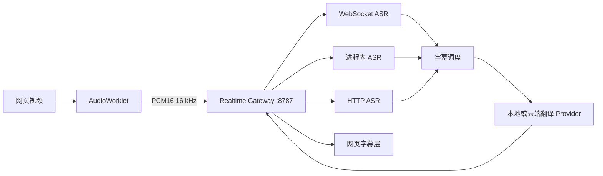

# 自定义本地模型接入设计

状态：已实现

适用仓库：`xiezhx9/hear-me-out`

延伸设计：[GPU 流式 ASR 与低延迟 NMT 调度设计](./gpu-asr-nmt-design.md)

## 1. 背景

项目原有实时字幕链路主要面向云端语音识别和翻译服务。本设计在不改变浏览器扩展通信协议的前提下，增加可配置的本地模型接入能力，使用户可以根据模型格式和性能需求选择不同运行方式。

本地能力分为四类：

- 常驻 WebSocket ASR：适合原生流式模型和低延迟字幕。
- 进程内流式 ASR：由后端直接加载 Sherpa-ONNX 兼容模型。
- HTTP ASR：兼容已有文件转写接口，以固定窗口提供近实时字幕。
- OpenAI 兼容翻译：连接本地推理服务并使用自定义翻译模型。

内置 Provider 是这些接入方式的预设适配器。端点、模型目录和模型名称均通过配置提供，不依赖固定机器路径。

## 2. 设计目标

1. 浏览器只连接统一的实时网关，不直接访问各个模型服务。
2. 本地 Provider 不要求云端账号或 API Key。
3. 支持替换 ASR 和翻译模型，同时保留现有云端 Provider。
4. 流式部分结果能够立即更新原文和预览译文。
5. 过期翻译可取消，最终字幕优先于中间结果。
6. 本地服务失败时不自动上传音频或文本到云端。
7. 音频缓冲、WAV 编码和文本合并保持独立并可测试。

## 3. 总体架构



核心约束：

- 扩展与网关之间继续使用 `ws://127.0.0.1:8787/realtime`。
- 音频统一为 16 kHz、单声道、PCM16。
- 一个浏览器会话对应一个 ASR 会话。
- Provider 负责协议适配，字幕调度不依赖具体模型名称。

## 4. Provider 模型

### 4.1 ASR Provider

| Provider | 接入方式 | 用途 |
|----------|----------|------|
| `local-funasr-stream` | WebSocket | 兼容 FunASR `2pass` 协议的常驻流式服务 |
| `local-vosk-ja-stream` | WebSocket | 独立低开销流式识别服务预设 |
| `local-nemotron-ja-stream` | 进程内 | Sherpa-ONNX Transducer 模型预设 |
| `local-sensevoice-http` | HTTP | OpenAI 风格文件转写接口兼容模式 |

Provider ID 保留具体名称以兼容现有配置，但架构按“WebSocket、进程内、HTTP”三种能力划分。新增模型时优先复用已有协议适配器；协议不同再增加新的 Provider。

### 4.2 翻译 Provider

`local-hy-mt2` 是本地 OpenAI Chat Completions 兼容预设，负责：

- 提供回环地址和模型名默认值。
- 允许空 API Key。
- 根据字幕、网页和文档场景选择提示词。
- 将响应规范化为与输入等长的字符串数组。

模型服务只需兼容 `/v1/chat/completions`，实际模型名称由 `AI_TRANSLATION_MODEL` 指定。

## 5. 配置

### 5.1 常驻 WebSocket ASR

```dotenv
ASR_PROVIDER=local-funasr-stream
ASR_ENDPOINT=ws://127.0.0.1:10095
ASR_MODEL=your-streaming-model
```

服务应在启动时加载模型，并持续接收 PCM16 二进制帧。模型加载不能发生在每个音频分段请求中。

### 5.2 进程内流式 ASR

```dotenv
ASR_PROVIDER=local-nemotron-ja-stream
ASR_MODEL_DIR=C:\path\to\streaming-asr-model
ASR_LANGUAGE=ja
SHERPA_ONNX_PROVIDER=cpu
SHERPA_ONNX_NUM_THREADS=2
```

模型目录需要包含：

```text
encoder.int8.onnx
decoder.int8.onnx
joiner.int8.onnx
tokens.txt
```

每个会话创建独立识别流，识别器在进程内复用。模型是否支持语言提示和可用 Execution Provider 取决于模型导出格式与本机运行库。

### 5.3 HTTP ASR

```dotenv
ASR_PROVIDER=local-sensevoice-http
ASR_ENDPOINT=http://127.0.0.1:8000/v1/audio/transcriptions
ASR_MODEL=your-asr-model
LOCAL_ASR_WINDOW_MS=1200
LOCAL_ASR_OVERLAP_MS=200
```

该模式将连续 PCM 封装为重叠 WAV 窗口。它用于兼容文件转写服务，不等同于原生流式识别。

### 5.4 本地翻译

```dotenv
TRANSLATION_PROVIDER=local-hy-mt2
AI_TRANSLATION_BASE_URL=http://127.0.0.1:8001/v1
AI_TRANSLATION_MODEL=your-translation-model
```

## 6. 运行时流程

1. 扩展发送 `session.start`，网关根据设置创建 ASR 会话。
2. AudioWorklet 持续发送 PCM16 音频帧。
3. ASR Provider 返回部分结果或最终结果。
4. 字幕调度器为部分结果分配 revision，并触发去抖后的预览翻译。
5. 新 revision 到达时取消已经过期的翻译请求。
6. 最终结果立即进入高优先级翻译，不等待旧的部分结果。
7. 网关将原文、译文、revision 和完成状态发回扩展。

网页、划词和 PDF 翻译不经过 ASR，直接复用翻译 Provider。

## 7. 低延迟策略

- 浏览器按短帧发送音频，避免积累大窗口。
- 流式 ASR 只在识别文本变化时推送结果。
- 部分翻译使用短去抖，减少重复请求。
- 会话内限制最终翻译并发，避免不同用户相互阻塞。
- 最终结果到达时取消同一 revision 的旧请求。
- 本地字幕限制输出 token 数，降低首字等待时间。
- 缓冲区达到上限时记录丢弃时长，避免延迟无限增长。

端到端延迟由以下部分组成：

```text
音频步长 + ASR 推理 + 部分结果去抖 + 翻译推理 + 页面更新
```

因此不能只根据单次模型推理耗时判断实时体验，应记录首个原文、首个译文和最终字幕三个时间点。

## 8. 代码结构

```text
scripts/
├── realtime-translation-server.mjs
└── server/
    ├── asr/
    │   ├── local-funasr-stream.mjs
    │   ├── local-nemotron-stream.mjs
    │   ├── local-sensevoice.mjs
    │   ├── local-vosk-stream.mjs
    │   └── vosk-stream-server.py
    ├── audio/
    │   ├── pcm-window-buffer.mjs
    │   └── wav.mjs
    ├── transcript/
    │   └── merger.mjs
    └── translation/
        └── local-hy-mt2.mjs

test/server/
├── local-funasr-stream.test.mjs
├── local-sensevoice.test.mjs
├── pcm-window-buffer.test.mjs
├── transcript-merger.test.mjs
└── wav.test.mjs
```

ASR 模块统一暴露以下生命周期：

```js
{
  async start() {},
  pushPcm(chunk) {},
  async stop() {},
  async close() {}
}
```

回调统一为：

```js
{
  onTranscript(text, meta),
  onError(error),
  onMetrics(metrics)
}
```

## 9. 错误与隐私

- 本地服务不可用时显示明确错误，不自动切换云端 Provider。
- 翻译失败时保留原文，不把错误文本显示为字幕。
- 超时请求使用 `AbortSignal` 取消，释放后续请求容量。
- 日志记录耗时、队列和丢帧指标，不记录 API Key。
- 本地预设默认使用 `127.0.0.1`、`localhost` 或 `[::1]`。

## 10. 测试与验收

自动测试覆盖：

- PCM 窗口与重叠计算。
- WAV 头和数据长度。
- 分段文本去重合并。
- WebSocket 配置、音频发送与最终帧处理。
- HTTP ASR 串行请求和错误处理。
- 本地翻译 URL、空 API Key 和返回值解析。

提交前运行：

```bash
npm test
npm run typecheck
npm run build
```

验收标准：

1. 本地和云端 Provider 可以独立选择。
2. 本地 ASR 能持续产生部分结果和最终结果。
3. 最终字幕不会被过期的部分翻译覆盖。
4. 本地服务故障时不会把内容发送到云端。
5. 配置中不包含个人绝对路径。
6. 类型检查、测试和构建全部通过。
