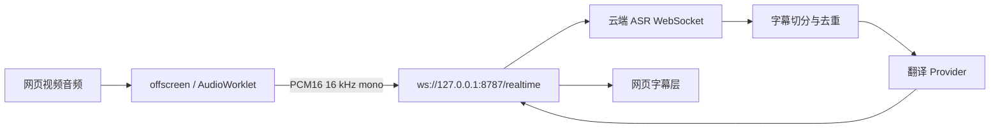
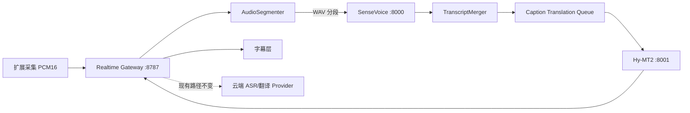

# 本地 SenseVoice 与 Hy-MT2 接入设计

状态：已实现

目标版本：`0.2.0`

适用仓库：`xiezhx9/hear-me-out`

## 1. 背景

当前扩展已经具备完整的浏览器音频采集、字幕展示、后端 WebSocket 通信和多种云端 ASR/翻译 Provider，但尚不能直接使用本机部署的两个服务：

- SenseVoice ASR：`http://127.0.0.1:8000/v1/audio/transcriptions`
- Hy-MT2：`http://127.0.0.1:8001/v1/chat/completions`

现有音频链路向后端持续发送 16 kHz、单声道、PCM16 数据；已部署的 SenseVoice 接口接收完整 WAV 文件，不是流式 WebSocket。要获得低于 1 秒的体验，主路径必须使用常驻模型的 FunASR WebSocket 服务；原有 SenseVoice HTTP 接口只保留为兼容模式。当前 SenseVoice GGUF 文件属于后者，不能直接用作 `:10095` 的流式模型。

Hy-MT2 已由 llama.cpp 暴露为 OpenAI 兼容接口，现有翻译客户端可以复用，但需要一个不强制 API Key、带固定默认地址和模型名的专用 Provider。

## 2. 目标与非目标

### 2.1 目标

1. 在扩展设置中新增“本地 FunASR 流式”、“本地 SenseVoice HTTP”和“本地 Hy-MT2”选项。
2. 不要求云端账号或 API Key。
3. 支持视频实时字幕、网页翻译、划词翻译和 PDF 翻译使用本地 Hy-MT2。
4. 保留所有现有云端 Provider 的行为和配置兼容性。
5. 本地 ASR 请求保持单并发，避免重复加载模型导致显存争用。
6. 本地服务不可用时给出明确错误，不静默切换到会上传内容的云端服务。
7. 为符合 FunASR WebSocket 协议的常驻流式 ASR 模型保留 Provider 接口。

### 2.2 非目标

- 本阶段不负责启动、停止或下载 SenseVoice/Hy-MT2 模型。
- 不把模型文件打包进浏览器扩展。
- 不重写现有云端 ASR 协议实现。
- 不在第一版实现说话人分离、时间戳逐词对齐或字幕文件导出。
- 不把固定窗口 HTTP ASR 描述为“原生流式 ASR”；它是近实时分段识别。

## 3. 当前架构



主要职责：

- `src/offscreen/offscreen.ts`：捕获标签页音频，发送二进制 PCM 帧。
- `src/types.ts`：保存 Provider 类型、设置结构和默认值。
- `src/popup/popup.ts`：Provider 预设、字段显示和设置持久化。
- `src/background.ts`：设置迁移、网页/PDF 翻译请求转发。
- `scripts/realtime-translation-server.mjs`：ASR 连接、字幕切分、翻译队列和 HTTP 路由，目前职责过多。

## 4. 目标架构



核心原则：

- 扩展与 `8787` WebSocket 协议保持不变。
- 本地模型只由 Node 后端访问，浏览器不直接访问 `8000/8001`。
- 本地 Provider 使用明确名称，不借用 `custom` 的隐式行为。
- ASR 分段、WAV 编码和结果合并是独立、可测试模块。

## 5. Provider 与配置模型

### 5.1 Provider ID

在 `src/types.ts` 中增加：

```ts
type AsrProviderId =
  | "local-funasr-stream"
  | "local-sensevoice-http"
  | "volcengine"
  | "aliyun"
  | "tencent"
  | "baidu"
  | "iflytek";

type TranslationProviderId =
  | "local-hy-mt2"
  | "microsoft"
  | "deepseek"
  | "kimi"
  | "qwen"
  | "glm"
  | "minimax"
  | "mimo"
  | "custom";
```

专用 ID 优于把两个服务都配置成 `custom`，原因是：

- 本地服务不应强制要求 API Key。
- 可提供正确默认地址、模型名和提示词。
- 可实施仅允许回环地址的安全规则。
- 错误信息和健康检查可以指向具体服务。

### 5.2 设置结构

第一版复用现有字段，避免大范围迁移：

```ts
asr: {
  provider: "local-funasr-stream",
  endpoint: "ws://127.0.0.1:10095",
  model: "funasr-2pass"
}

translation: {
  provider: "local-hy-mt2",
  protocol: "openai",
  apiKey: "",
  baseUrl: "http://127.0.0.1:8001/v1",
  model: "hy-mt2",
  disableThinking: true
}
```

`schemaVersion` 从 7 升到 8。迁移只补充新字段，不覆盖用户已有 Provider 选择。现有默认 Provider 保持不变；用户在弹窗中显式选择本地模型。

### 5.3 环境变量

新增并兼容旧配置：

```dotenv
ASR_PROVIDER=local-funasr-stream
ASR_ENDPOINT=ws://127.0.0.1:10095
ASR_MODEL=funasr-2pass

TRANSLATION_PROVIDER=local-hy-mt2
AI_TRANSLATION_BASE_URL=http://127.0.0.1:8001/v1
AI_TRANSLATION_MODEL=hy-mt2

LOCAL_ASR_WINDOW_MS=1200
LOCAL_ASR_OVERLAP_MS=200
LOCAL_ASR_MAX_PENDING_MS=8000
LOCAL_ASR_TIMEOUT_MS=10000
```

兼容现有 GGUF HTTP 服务时显式配置：

```dotenv
ASR_PROVIDER=local-sensevoice-http
ASR_ENDPOINT=http://127.0.0.1:8000/v1/audio/transcriptions
ASR_MODEL=sensevoice
```

`ASR_ENDPOINT` 作为新的通用名称；读取时继续接受现有 `ASR_WS_URL`，保证向后兼容。

## 6. 本地接口契约

### 6.1 FunASR 流式主路径

前置条件：另行部署一个支持 FunASR `2pass` WebSocket 协议、且模型常驻内存的**流式 ASR 模型**到 `ws://127.0.0.1:10095`。它不是当前的 SenseVoice GGUF HTTP 包装器；后者继续走 6.2 的兼容路径。

请求：先发送配置 JSON，再连续发送 16 kHz PCM16 二进制帧。

```json
{
  "mode": "2pass",
  "chunk_size": [5, 10, 5],
  "chunk_interval": 10,
  "encoder_chunk_look_back": 4,
  "decoder_chunk_look_back": 1,
  "audio_fs": 16000,
  "is_speaking": true
}
```

`[5,10,5]` 配合 `chunk_interval: 10` 对应 60 ms 在线音频步长（`60 × 10 ÷ 10`）。服务端返回 `2pass-online` 部分文本以驱动即时字幕，并在 VAD 终止时返回最终文本。

### 6.2 SenseVoice HTTP 兼容路径

请求：

```http
POST /v1/audio/transcriptions
Content-Type: multipart/form-data

file=<16 kHz mono PCM16 WAV>
model=sensevoice
response_format=json
keep_tags=false
```

响应：

```json
{ "text": "こんにちは。今日はいい天気ですね。" }
```

健康检查：

```http
GET /health
```

### 6.3 Hy-MT2

请求 URL 由 `baseUrl` 规范化为 `/chat/completions`：

```http
POST /v1/chat/completions
Content-Type: application/json
```

```json
{
  "model": "hy-mt2",
  "temperature": 0,
  "stream": false,
  "messages": [
    {
      "role": "system",
      "content": "Translate the input into Simplified Chinese and return JSON only."
    },
    {
      "role": "user",
      "content": "[\"こんにちは。\"]"
    }
  ]
}
```

响应沿用 OpenAI Chat Completions：

```json
{
  "choices": [
    {
      "message": {
        "content": "[\"你好。\"]"
      }
    }
  ]
}
```

Hy-MT2 本地 Provider 不要求 API Key；若用户填写，则仍发送 `Authorization: Bearer ...`，便于连接带鉴权的局域网代理。

## 7. ASR 分段策略

`local-sensevoice-http` 当前是文件级 HTTP 推理，必须在后端把连续 PCM 转为分段 WAV。它可实现近实时字幕，但不是原生流式：当前 Windows 二进制只支持 `-a audio.wav` 单文件输入，每段请求都会产生子进程和模型初始化开销。因此该路径的目标是 2–3 秒级字幕，不承诺亚秒级延迟。

第一版采用确定性的固定窗口方案：

- 输入格式：16 kHz、单声道、16-bit little-endian PCM。
- 主窗口：1200 ms。
- 相邻窗口重叠：200 ms，降低词语在边界处被截断的概率。
- 每个 WebSocket 会话最多一个 SenseVoice 请求在执行。
- 推理期间继续缓存音频，缓存上限 8 秒。
- 超过上限时优先丢弃最旧的重叠区和静音帧；若仍超限，向客户端发送可见的拥塞错误。
- `session.stop` 时提交剩余的有效音频。

结果合并使用 `TranscriptMerger`：

1. 标准化空白和标点。
2. 比较上一段后缀与当前段前缀。
3. 移除由 200 ms 重叠造成的最长重复片段。
4. 把新增文本交给现有 `handleTranscriptText` 和字幕翻译队列。
5. 合并置信度不足时保留当前段，不做激进删除。

选择固定窗口作为 HTTP 兼容路径，是为了确保延迟、内存和请求频率可预测。低延迟主路径不使用窗口推理：它直接转发浏览器的 40 ms PCM 帧，并聚合为 60 ms FunASR stride 后发往常驻 WebSocket 服务。

## 8. 代码结构

建议新增以下目录，并逐步缩小当前单文件后端的职责：

```text
scripts/
├── realtime-translation-server.mjs     # 启动、路由、WebSocket 会话编排
└── server/
    ├── config.mjs                      # 环境变量解析和默认值
    ├── audio/
    │   ├── pcm-window-buffer.mjs       # 窗口、重叠、背压
    │   └── wav.mjs                     # PCM16 -> WAV
    ├── asr/
    │   ├── provider.mjs                # ASR Provider 契约与工厂
    │   ├── local-funasr-stream.mjs      # 常驻 WebSocket、60 ms stride、在线部分结果
    │   └── local-sensevoice.mjs        # multipart HTTP、串行推理、超时
    ├── transcript/
    │   └── merger.mjs                  # 相邻分段去重合并
    └── translation/
        ├── provider.mjs                # 翻译 Provider 分派
        ├── openai-compatible.mjs       # 复用通用 Chat Completions 请求
        └── local-hy-mt2.mjs            # 本地默认值与提示词策略

test/
└── server/
    ├── pcm-window-buffer.test.mjs
    ├── wav.test.mjs
    ├── transcript-merger.test.mjs
    ├── local-sensevoice.test.mjs
    ├── local-hy-mt2.test.mjs
    └── local-pipeline.integration.test.mjs
```

### 8.1 ASR Provider 契约

```js
export function createAsrSession(config, callbacks) {
  return {
    async start() {},
    pushPcm(chunk) {},
    async stop() {},
    async close() {}
  };
}
```

`callbacks` 只暴露：

```js
{
  onTranscript(text, meta),
  onError(error),
  onMetrics(metrics)
}
```

现有云端 Provider 暂不全部迁出大文件。本次仅让 `connectAsr()` 对两个本地 Provider 分派到新模块；后续再逐个迁移云端实现，降低一次性重构风险。

### 8.2 翻译 Provider 契约

```js
export async function translateTexts(texts, targetLanguage, options) {
  return translations;
}
```

`local-hy-mt2.mjs` 只负责：

- 补齐本地默认 URL 和模型名。
- 允许空 API Key。
- 选择适合字幕、网页或文档的提示词。
- 调用 `openai-compatible.mjs`。
- 将返回值规范化为与输入等长的字符串数组。

## 9. 运行时流程

1. 用户在扩展弹窗选择本地 SenseVoice 和本地 Hy-MT2。
2. `offscreen.ts` 建立 `ws://127.0.0.1:8787/realtime`，发送 `session.start`。
3. 浏览器持续发送 PCM 帧；Gateway 把帧交给 `LocalSenseVoiceSession`。
4. `LocalFunasrStreamSession` 聚合 60 ms PCM stride 并发送至常驻 `:10095` WebSocket 服务。
5. 在线部分结果立即更新字幕，并由 Hy-MT2 翻译为同一 revision 的预览译文。
6. VAD 结束的最终结果进入现有字幕切分与翻译队列。
7. `local-sensevoice-http` 被选择时才走 `PcmWindowBuffer`、WAV 封装和 `:8000` 串行转写。
8. Gateway 把 `{sourceText, translatedText, isFinal, revision}` 发回扩展。

网页、划词和 PDF 翻译跳过 ASR，直接复用第 7 步。

## 10. 错误、回退与隐私

### 10.1 错误处理

- SenseVoice 连接失败：字幕层显示“本地 SenseVoice 未启动”，会话保留并按指数退避重试。
- Hy-MT2 连接失败：显示原文字幕和翻译错误状态，不自动调用微软或其他云端翻译。
- ASR 超时：取消当前请求，继续处理下一窗口，记录丢失的时间范围。
- 返回格式异常：保留原文，记录可诊断日志，不把错误字符串当字幕。

### 10.2 回退规则

本地 Provider 必须采用“显式本地”语义：

- 不自动回退到云端 ASR。
- 不自动回退到微软翻译。
- 用户切换到 `balanced`、`microsoft` 或其他 Provider 时，才允许原有回退行为。

这样可以保证用户选择本地模式后，音频和文本不会意外离开机器。

### 10.3 地址限制

本地 Provider 默认只接受以下主机：

- `127.0.0.1`
- `localhost`
- `[::1]`

若未来需要局域网服务，应增加显式“允许远程本地模型地址”设置和警告，而不是静默放开。

## 11. 可观测性

后端为每次会话维护以下指标，默认只写本地日志：

- `audio_received_ms`
- `asr_queue_ms`
- `asr_inference_ms`
- `asr_window_ms`
- `translation_queue_ms`
- `translation_inference_ms`
- `caption_end_to_end_ms`
- `audio_dropped_ms`
- `asr_error_count`
- `translation_error_count`

HTTP 根路径或 `/health` 返回 Provider 状态和最近一次延迟，但不返回字幕内容、API Key 或文件路径。

## 12. 测试策略

### 12.1 单元测试

- WAV 头长度、采样率、声道数和数据长度正确。
- 1200 ms 窗口及 200 ms 重叠字节数正确。
- 单并发保证：前一请求完成前不启动下一请求。
- 缓存上限和停止时尾段提交正确。
- 日语/英语/中文的重叠文本合并正确。
- Hy-MT2 URL 规范化和空 API Key 行为正确。
- JSON 数组、`{"translations": [...]}` 和逐行文本均可解析。

### 12.2 集成测试

- 使用 mock HTTP 服务验证 PCM -> WAV -> ASR -> 翻译 -> WebSocket 字幕全链路。
- 本地服务 500、超时、无效 JSON 和断线重连。
- 原有云端 Provider 的设置解析回归测试。

### 12.3 可选真实模型冒烟测试

在 SenseVoice/Hy-MT2 已启动时运行，不加入默认 CI：

```powershell
npm run test:local-models
```

测试输入使用仓库中的短日语音频，验证：

- ASR 返回非空日语文本。
- 翻译返回非空中文文本。
- 端到端处理速度快于音频时长。

## 13. 验收标准

1. 弹窗可选择“本地 SenseVoice”和“本地 Hy-MT2”，无需填写密钥。
2. 使用默认本地地址时，10 秒日语音频能持续产生原文与中文译文。
3. 使用 `local-funasr-stream` 时，暖机后首个原文部分字幕 P50 不高于 1 秒；Hy-MT2 预览译文 P50 不高于 1.5 秒。`local-sensevoice-http` 仍仅承诺 2–3 秒级近实时。
4. ASR 和翻译请求均不出现同一模型的并发推理。
5. 本地模型故障时不会向任何云端 Provider 发送音频或文本。
6. 云端 ASR、微软翻译和现有自定义模型行为不变。
7. `npm run typecheck`、`npm run build` 和新增测试全部通过。

## 14. 实施顺序

### 阶段 A：可测试基础模块

1. 增加 WAV、窗口缓冲和文本合并模块。
2. 增加 Node 内置测试运行器和单元测试。

### 阶段 B：本地 ASR

1. 增加 `local-funasr-stream` Provider，并保留 `local-sensevoice-http` 兼容 Provider。
2. 接入 WebSocket 会话生命周期和背压。
3. 增加健康检查和错误状态。

### 阶段 C：本地翻译

1. 抽取 OpenAI 兼容请求函数。
2. 增加 `local-hy-mt2` Provider。
3. 让字幕、网页、划词和 PDF 翻译共享该 Provider。

### 阶段 D：扩展设置与文档

1. 增加弹窗预设和设置迁移。
2. 更新 `.env.example` 与 README。
3. 完成真实模型冒烟测试和性能记录。

## 15. 设计决策摘要

- 采用专用 Provider，而不是要求用户手工配置两个 `custom` 服务。
- 保持扩展到 `8787` 的 WebSocket 协议不变。
- 以常驻 FunASR WebSocket 作为实时主路径；固定窗口 SenseVoice HTTP 仅作为兼容路径。
- SenseVoice 请求严格单并发，优先稳定性和显存可控性。
- 本地模式失败时不自动回退云端，优先保证隐私语义。
- 只对本地新增路径做模块化，不在同一版本重写所有云端 Provider。
